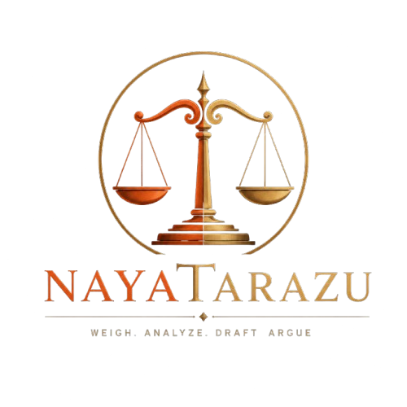
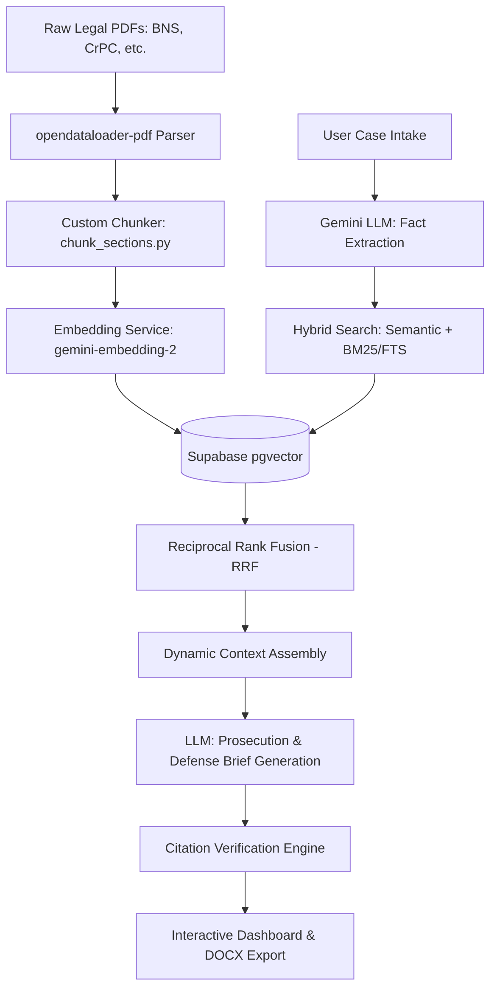

# ⚖️ Nyaya Tarazu (न्याय तराजू)

<p align="center">
  
</p>

<p align="center">
  <strong>RAG-Grounded Dual-Brief Legal Drafting Assistant for Indian Criminal Law</strong>
</p>

<p align="center">
  
  
  
  
  
  
</p>

---

## 📖 Overview

**Nyaya Tarazu** ("Scales of Justice") is an AI-powered legal ingestion pipeline and interactive case drafting assistant designed specifically for Indian Criminal Law. It handles the transition between old laws (Indian Penal Code - **IPC**, Code of Criminal Procedure - **CrPC**, **Indian Evidence Act**) and the newly implemented criminal codes (Bharatiya Nyaya Sanhita - **BNS**, Bharatiya Nagarik Suraksha Sanhita - **BNSS**, Bharatiya Sakshya Adhiniyam - **BSA**).

The system performs:
1. **Intelligent PDF Ingestion & Parsing**: Extracting legal sections from source criminal code books.
2. **Hybrid RAG (Retrieval-Augmented Generation)**: Fusing semantic embeddings (`gemini-embedding-2`) and Full-Text Search (FTS) using Reciprocal Rank Fusion (RRF) on Supabase (pgvector).
3. **Structured Case Analysis & Citation Verification**: Analyzing intake briefs, extracting verified facts, cross-referencing statutes, and verifying citations dynamically to prevent hallucinations.
4. **Dual-Brief Generation**: Generating balanced Prosecution and Defense briefs alongside exports to MS Word (.docx).
5. **Interactive UI**: Featuring custom Three.js / React Three Fiber interactive 3D Scales of Justice that respond to case statistics.

---

## 🏗️ Architecture & RAG Pipeline



---

## 🛠️ Tech Stack & Key Technologies

*   **Frontend**: React 19, TypeScript, Vite, Tailwind CSS / Vanilla HSL-designed dark-first stylesheet, Three.js (React Three Fiber) for interactive 3D elements.
*   **Backend**: FastAPI (Python 3.11+), Uvicorn, Pydantic v2 schemas.
*   **Database**: Supabase PostgreSQL with `pgvector` extension for similarity search.
*   **AI Models**: Google Gemini API via `google-genai` SDK (`gemini-2.5-flash` for extraction/drafting, `models/gemini-embedding-2` for embeddings).
*   **Document Generation**: `python-docx` for structured Word exports.

---

## 📂 Project Structure

```
├── backend/
│   ├── main.py                  # FastAPI Application Entrypoint
│   ├── requirements.txt         # Backend Python Dependencies
│   ├── models/
│   │   └── schemas.py           # Pydantic Request/Response Models
│   ├── routers/
│   │   ├── extract.py           # Fact extraction endpoint
│   │   ├── retrieve.py          # Vector + Full-text search endpoint
│   │   ├── generate.py          # Brief drafting endpoint
│   │   ├── export.py            # Word document (.docx) generator
│   │   └── lookup.py            # Statutory code database explorer
│   └── services/
│       ├── llm.py               # Gemini API prompt orchestrator
│       ├── retrieval.py         # Hybrid search & RRF fusion queries
│       └── verification.py      # Statutory citation validator
│
├── frontend/
│   ├── src/
│   │   ├── components/
│   │   │   ├── ScaleScene.tsx   # Three.js 3D Scales of Justice scene
│   │   │   ├── BriefPanel.tsx   # Brief visualization component
│   │   │   └── CitationChip.tsx # Verified/Unverified badge
│   │   ├── services/
│   │   │   └── api.ts           # Axios Client for FastAPI Backend
│   │   └── index.css            # Dark-first layout stylesheet (Ink/Saffron)
│   ├── package.json             # Node.js dependencies & scripts
│   └── index.html               # Main HTML Shell
│
├── ingest/
│   ├── convert_pdfs.py          # PDF to structured JSON parsing
│   ├── chunk_sections.py        # Logic to extract legal sections
│   ├── embed_and_load.py        # Vector embedding and database loading
│   └── test_retrieval.py        # Pipeline testing harness
│
├── supabase/
│   └── migrations/
│       └── 001_legal_sections.sql # DB Schema, Indexes & Vector search RPCs
│
├── logo.png                     # Project Branding Logo
├── .gitignore                   # Workspace Git settings
├── requirements.txt             # Ingestion Pipeline Dependencies
└── MEMORY.md                    # Project Ingestion & Modification Logs
```

---

## 🚀 Setup & Installation

### 1. Database Setup (Supabase)
Create a Supabase project and execute the SQL file under [001_legal_sections.sql](file:///d:/be%20project/supabase/migrations/001_legal_sections.sql) in your Supabase SQL Editor. This will:
*   Enable `pgvector`.
*   Create the `legal_sections` table.
*   Setup columns for document metadata, raw text content, and `vector(768)` embeddings.
*   Configure hybrid text indexing and the `match_legal_sections` RPC.

### 2. Environment Configuration
Create a `.env` file in the root directory:
```env
SUPABASE_URL=https://<your-project-id>.supabase.co
SUPABASE_ANON_KEY=<your-anon-key>
GEMINI_API_KEY=<your-gemini-api-key>
```

### 3. Setup and Run Backend
```bash
# Navigate to backend
cd backend

# Create & activate virtual environment (optional)
python -m venv .venv
.venv\Scripts\activate

# Install dependencies
pip install -r requirements.txt

# Start local FastAPI server
python main.py
```
The backend API documentation will be available at `http://localhost:8000/docs`.

### 4. Setup and Run Frontend
```bash
# Navigate to frontend
cd frontend

# Install Node modules
npm install

# Run the dev server
npm run dev
```
The React development server will start at `http://localhost:5173`.

### 5. Ingestion Pipeline (To reload data)
If you wish to re-parse the legal source PDFs and ingest them into Supabase:
```bash
# Active virtualenv in root
pip install -r requirements.txt

# Run PDF extraction
python ingest/convert_pdfs.py

# Run chunking logic
python ingest/chunk_sections.py

# Generate embeddings and populate DB
python -m ingest.embed_and_load
```

---

## 🏛️ Development & Design Choices
*   **Ink-Saffron Aesthetics**: Designed using an elegant, dark-first color scheme built using HSL colors (Ink `#0e1117`, Brass/Gold highlights, and Crimson-Saffron indicators) tailored for professional legal interfaces.
*   **Citation Validation Engine**: Instead of trusting the LLM to output accurate section laws, the backend parses out citation tokens, looks them up in the vector store, and verifies if they match the retrieved legal context.
*   **RRF Fusion**: Fuses full-text search (lexical) and vector search (semantic) to guarantee that both exact keywords (like section numbers) and high-level legal semantic queries yield top-tier relevant matches.

---

<p align="center">
</p>
