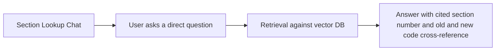

# Nyaya Tarazu — Product Flow

## Primary user flow: case intake to dual brief

```mermaid
flowchart TD
    A[Landing page] --> B[Sign up / Log in - Supabase Auth]
    B --> C[Case Intake screen]
    C --> D[User pastes/types case narrative]
    D --> E[Fact Extraction runs]
    E --> F{Extracted facts shown for confirmation}
    F -- user edits a field --> E
    F -- confirmed --> G[Retrieval runs against vector DB]
    G --> H[Dual Brief Generation: prosecution + defense in parallel]
    H --> I[Citation Verification pass]
    I --> J[Results screen: split view, Prosecution | Defense]
    J --> K{User action}
    K -- Export --> L[Word/PDF download]
    K -- Ask a follow-up --> M[Section Lookup Chat]
    K -- Edit facts and regenerate --> C
```

## Screen-by-screen detail

### 1. Landing page
- Single job: communicate "AI weighs both sides of your case, grounded in verified Indian law" in one glance.
- Primary CTA: "Start a case" leads to the intake screen (or sign-up if not authenticated).
- Secondary CTA: "See how it works" scrolls to the split-section explainer described in `design.md`.

### 2. Auth
- Supabase Auth, email + optional Google sign-in.
- No "continue without account" shortcut — case data is sensitive, so require auth before any case data is entered.

### 3. Case Intake
- One large free-text field: "Describe the case facts."
- Optional structured fields below it (offence date, location/state, parties) that are genuinely optional, since a lawyer may not have them all at hand yet.
- A visible note explaining that offence date determines whether the system reasons under IPC/CrPC/Evidence Act or BNS/BNSS/BSA.

### 4. Fact confirmation
- Shows the extracted structured facts (parties, offence type, intent, weapon/method, injury, relationship, evidence available) as editable fields, not a black box.
- User can correct any field before retrieval runs, since extraction errors compound downstream.

### 5. Results (the core screen)
- Literal split view: Prosecution brief on the left (saffron accent), Defense brief on the right (brass accent), per `design.md`.
- Each brief shows: Issues, then Applicable Provisions (with `IBM Plex Mono` citation styling), then Arguments, then Supporting Precedents, then Prayer/Relief Sought.
- Any citation flagged as unverifiable by the verification layer is visibly marked, not hidden, with a short explanation such as "not found in corpus, verify manually."
- Persistent disclaimer banner: "AI-generated draft. Verify against original sources before relying on this in any proceeding."

### 6. Export
- One-click Word or PDF download of either brief, formatted like an actual drafting document, not a screenshot of the web UI.

### 7. Section Lookup Chat
- A lighter, secondary mode for direct questions such as "What's the BNS equivalent of IPC 302?" Kept separate from the case-intake flow, and reachable from a persistent nav item rather than buried in the results screen.

## Secondary flow: direct section lookup, no case needed



## Error and empty states to design explicitly

- No facts extracted from garbled or empty input: "Couldn't find enough case detail here. Try adding who did what, and when." Not a generic "Error 400."
- Retrieval returns nothing relevant: "No matching provisions found. This may be outside the current corpus (criminal law only)." Sets scope expectations rather than pretending to have an answer.
- Citation verification fails on several items: surface each flag inline next to the citation it belongs to, not as a single blocking error page. The lawyer should still get the draft, just with clear flags on what to double-check.
